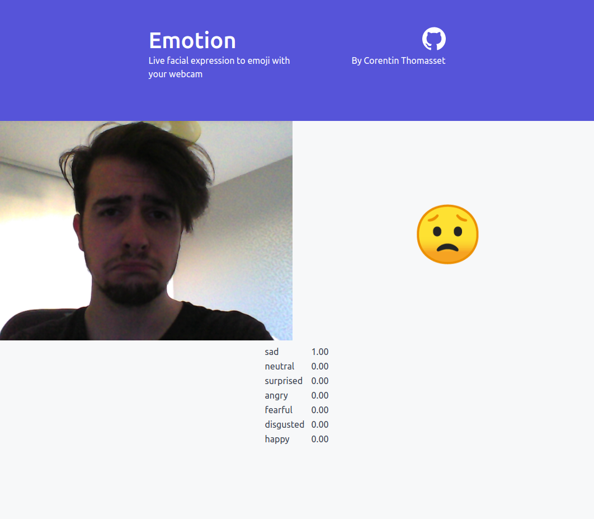

# Emotion
Live facial expression to emoji with your webcam. Test it [here](emotion.ctmsst.vercel.app).



## Dev
Install dependencies by running the following command:
```shell
npm install
```

Then compiles and hot-reloads for development:
```shell
npm run dev
```

Compile for production by running:
```shell
npm run build
```

## Contribute
**Pull requests are welcome !** Feel free to contribute.

## Credits
Coded with ❤️ by [Corentin Thomasset](https://twitter.com/cthmsst).

This project is built using the [parcel bundler](https://github.com/parcel-bundler/parcel), 
[less](https://github.com/less/less.js), [pug](https://github.com/pugjs/pug), and 
[typescript](https://github.com/microsoft/TypeScript), it is continuously deployed using 
[vercel.com](https://vercel.com) and uses [face-api.js](https://github.com/justadudewhohacks/face-api.js) and 
[spectre css](https://github.com/picturepan2/spectre) to run.

## License
This project is under the [MIT license](LICENSE).
